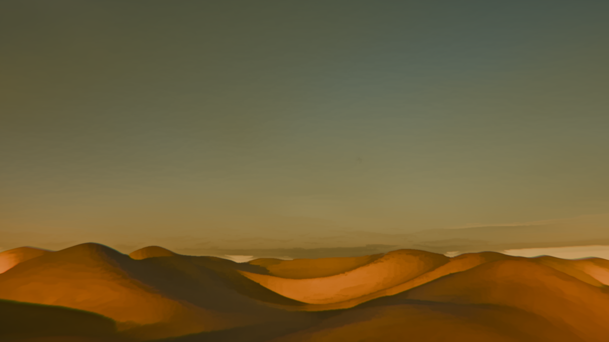
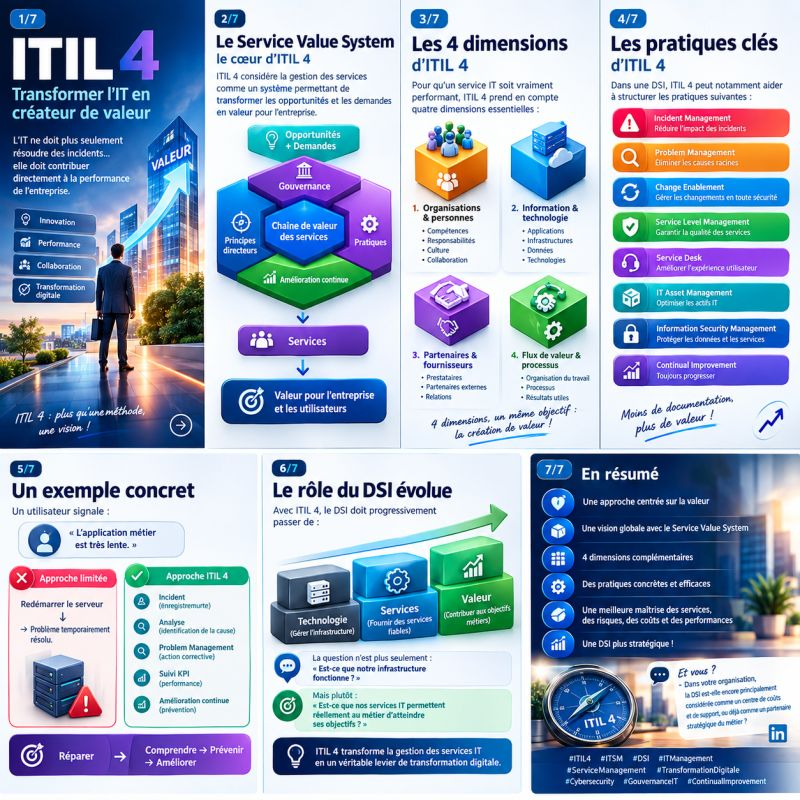

A tester dans le marp :
theme: uncover
_class: lead
paginate: false
backgroundColor: #1e293b
color: #f8fafc

# 🐯 Titre
Contenu...

---
# 🍔 Test des images
💡 Rappel des commandes magiques de Marp pour la mise en page (w:xx px)...
Exemple : Changer la taille à 50 px sur l'image suivante : 

---
# Image en arrière plan
 

---
# Découpage de l'écran en deux - version 1

• Couper l'écran en deux :  (l'image se place automatiquement sur la moitié droite de la slide)

---
# Découpage de l'écran en deux - version 2

• Image à droite - avec la contrainte de s'ajuster 😉

---

# Mise en page en grille

  
Bloc 1 (Gauche haut)

  
Bloc 2 (Droite haut)

  
Bloc 3 (Gauche bas)

  
Bloc 4 (Droite bas)

<!-- Tout le CSS est masqué à la fin du document -->

---

# Autre test de grille avec nouveau CSS

  
Bloc 1 (Gauche haut)

  
Bloc 2 (Droite haut)

  
Bloc 3 (Gauche bas)

  
Bloc 4 (Droite bas)

