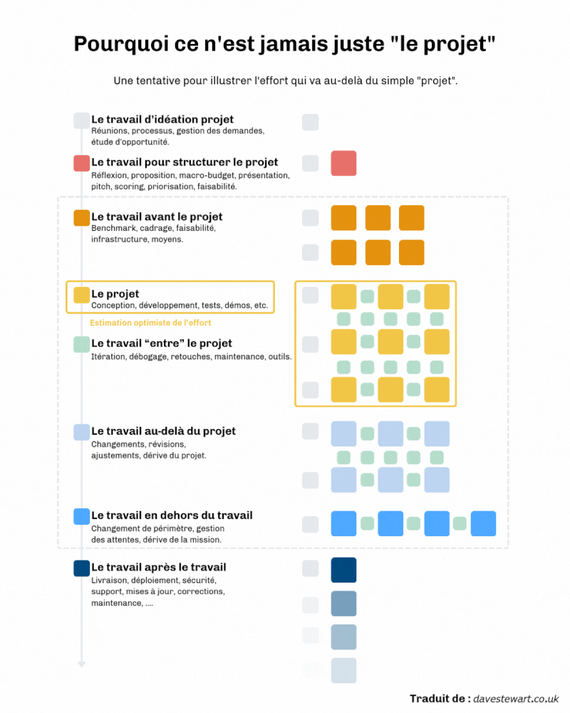

A tester dans le marp :
theme: uncover
_class: lead
paginate: false
backgroundColor: #1e293b
color: #f8fafc

# 🐯 Titre
Contenu...

<!-- Tout le CSS est masqué à la fin du document -->

---
# 🍔 Test des images
💡 Rappel des commandes magiques de Marp pour la mise en page :

• Changer la taille :  (pour fixer la largeur à 200 pixels).
---
# Image en arrière plan
 
---
# Découpage de l'ecrane en deux ?
• Couper l'écran en deux :  (l'image se place automatiquement sur la moitié droite de la slide)
* Image à droite :

---

# Mise en page en grille

  
Bloc 1 (Gauche haut)

  
Bloc 2 (Droite haut)

  
Bloc 3 (Gauche bas)

  
Bloc 4 (Droite bas)

